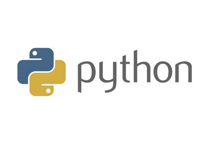

# What is *Phyton*?
---

Python is an interpreted programming language whose philosophy emphasizes a syntax that encourages readable code.

It is a multi-paradigm programming language, since it supports object-oriented, imperative programming and to a lesser extent, functional programming. It is an interpreted language, it uses dynamic typing and is multiplatform. You can use it to create web apps, games, even a search engine.

It is managed by the Python Software Foundation. It has an open source license called Python Software Foundation License, 1 which is compatible with the GNU General Public License from version 2.1.1, and incompatible in some earlier versions.

[Python official website](https://www.python.org/)
